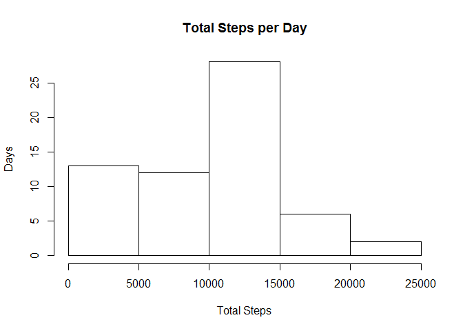
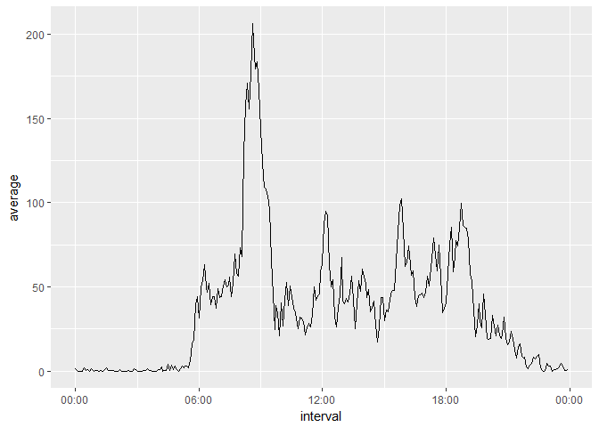
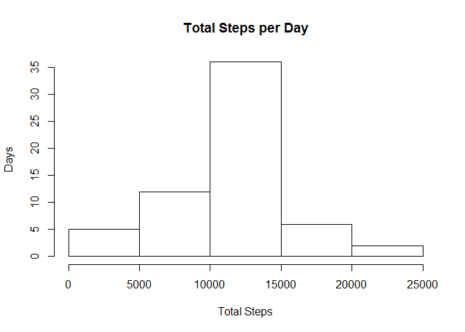

## Loading and preprocessing the data

Place the data file activit.zip in your working directory and run the following to load the data


```r
data <- read.csv(unz("activity.zip", "activity.csv"), header = TRUE)
head(data)
```

```
##   steps       date interval
## 1    NA 2012-10-01        0
## 2    NA 2012-10-01        5
## 3    NA 2012-10-01       10
## 4    NA 2012-10-01       15
## 5    NA 2012-10-01       20
## 6    NA 2012-10-01       25
```

## What is mean total number of steps taken per day?
First we find the total number of steps for each day and display a histogram of the results


```r
sum_by_day <- tapply(data$step, data$date, sum, na.rm = TRUE)
hist(sum_by_day, main = "Total Steps per Day", xlab = "Total Steps", ylab = "Days")
```

<!-- -->

The mean of the total and the median of the total are as follows


```r
print(mean(sum_by_day))
```

```
## [1] 9354.23
```

```r
print(median(sum_by_day))
```

```
## [1] 10395
```

## What is the average daily activity pattern?
We find the average number of steps for each time interval


```r
average_by_interval <- tapply(data$steps, data$interval, mean, na.rm = TRUE)
```

Converting the intervals into a list of time variables

```r
times <- unique(data$interval)
times <- formatC(times, width = 4, format = "d", flag = "0")
times <- strptime(times, "%H%M")
```

Plotting the time series of averages

```r
library(ggplot2)
data2 <- data.frame(interval = times, average = average_by_interval)
g <- ggplot(data2, aes(interval, average)) + geom_line() + scale_x_datetime(date_labels = "%H:%M")
print(g)
```

<!-- -->

Finding the maximum average number of steps and when it occurs

```r
library(lubridate)
```

```
## 
## Attaching package: 'lubridate'
```

```
## The following object is masked from 'package:base':
## 
##     date
```

```r
maximum <- max(data2$average)
location <- grep(maximum, data2$average)
h <- hour(data2[location, 1])
m <- minute(data2[location, 1])
print(paste("Maximum average number of steps at", h, ":", m))
```

```
## [1] "Maximum average number of steps at 8 : 35"
```

## Imputing missing values
Finding the number of missing values in the rows of our dataframe

```r
#1
sum(is.na(data$steps))
```

```
## [1] 2304
```

```r
sum(is.na(data$date))
```

```
## [1] 0
```

```r
sum(is.na(data$interval))
```

```
## [1] 0
```
We see that only the first column has missing values.

Replace each missing value with the mean of that interval

```r
#2-3 Using mean of each interval to replace NA
data_imputed <- data
for(i in 1:dim(data_imputed)[1]) {
    if(is.na(data_imputed$steps[i])) {
        data_imputed$steps[i] <- data2[as.character(data_imputed$interval[i]),2]
    }
}
```

Recalcuating the total number of steps per day and displaying a new histogram

```r
#4
sum_by_day2 <- tapply(data_imputed$step, data_imputed$date, sum)
hist(sum_by_day2, main = "Total Steps per Day", xlab = "Total Steps", ylab = "Days")
```

<!-- -->

Recomputing the mean and median of the totals

```r
print(mean(sum_by_day2))
```

```
## [1] 10766.19
```

```r
print(median(sum_by_day2))
```

```
## [1] 10766.19
```


## Are there differences in activity patterns between weekdays and weekends?
Now we add a factor indicating where a perticular day was a weekday or a weekend

```r
#Weekday vs Weekend
data_imputed$dayofweek <- weekdays(strptime(data_imputed$date, "%Y-%m-%d"))
wdays <- c("Monday", "Tuesday", "Wednesday", "Thursday", "Friday")
wend <- c("Saturday", "Sunday")
for(i in 1:dim(data_imputed)[1]) {
    if(data_imputed$dayofweek[i] %in% wdays) {
        data_imputed$dayofweek[i] <- 1
    } else {
        data_imputed$dayofweek[i] <- 2
    }
}
data_imputed$dayofweek <- factor(data_imputed$dayofweek, levels = c(1, 2), labels = c("Weekday", "Weekend"))
```

Finally we make two time series plots to compare activitiy between weekday and weekend.

```r
#Comparing plots
library(dplyr)
```

```
## 
## Attaching package: 'dplyr'
```

```
## The following objects are masked from 'package:lubridate':
## 
##     intersect, setdiff, union
```

```
## The following objects are masked from 'package:stats':
## 
##     filter, lag
```

```
## The following objects are masked from 'package:base':
## 
##     intersect, setdiff, setequal, union
```

```r
data3 <- as.tbl(data_imputed)
data3 <- group_by(data3, dayofweek, interval)
data3 <- summarise(data3, mean = mean(steps))

library(lattice)
xyplot(mean ~ interval | dayofweek, data = data3, type = "l", xlab = "Interval", ylab = "Number of Steps", layout = c(1,2))
```

<!-- -->


